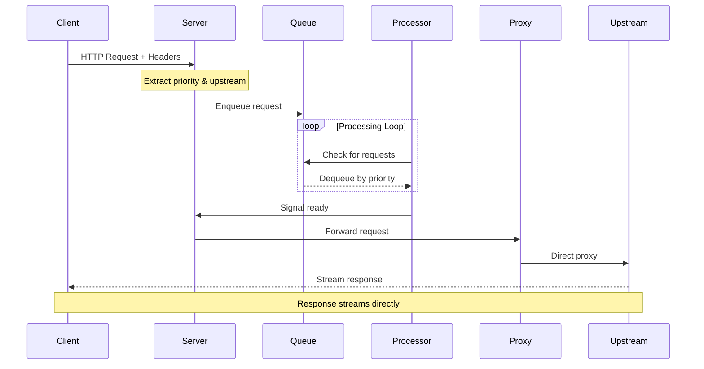
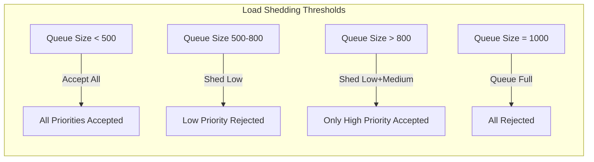

# Arbiter

Arbiter is a high-performance priority-based request gateway that sits between clients and upstream services, managing request flow based on configurable priorities and processing modes. It acts as an intelligent proxy that ensures critical requests are processed first while maintaining system stability under load.

## Overview

Modern distributed systems often struggle with request prioritization, especially when dealing with resource-intensive services like LLMs or ML inference endpoints. Arbiter solves this by implementing a priority queue system that aggregates incoming requests and forwards them to upstream services based on their priority levels. The system uses a fire-and-forget architecture, allowing it to handle massive throughputs while being completely agnostic to response content types, including streaming responses like Server-Sent Events (SSE).

## Architecture

### Request Flow

When a request arrives at Arbiter, it follows this path through the system:



The server component receives incoming HTTP requests and extracts metadata from headers to determine the target upstream service and request priority. Each request is assigned one of three priority levels (High, Medium, or Low) based on the Priority header. The request is then enqueued into a priority queue specific to its target upstream.

The processor component continuously monitors these queues, respecting configured concurrency limits for each upstream. When capacity becomes available, it dequeues the highest priority request and signals the server that the request is ready for forwarding. This fire-and-forget approach means the processor doesn't wait for responses, maximizing throughput.

Once signaled, the server uses an embedded reverse proxy to forward the request directly to the upstream service. The reverse proxy handles all response types transparently, whether they're simple JSON responses, large file downloads, or streaming SSE responses from LLM servers. The response flows directly from the upstream back to the client without buffering in Arbiter.

### Priority Queue Implementation

The priority queue is implemented as a binary min-heap, providing efficient O(log n) operations for both enqueue and dequeue operations. Within each priority level, requests maintain FIFO ordering based on their enqueue timestamp, ensuring fairness among requests of the same priority.

### Processing Modes

Arbiter supports two processing modes that can be configured per upstream service:

**Individual Mode** processes requests one at a time as they're dequeued from the priority queue. This mode is ideal for services that handle single requests efficiently, such as REST APIs or LLM servers. The max_concurrent configuration controls how many requests can be in-flight simultaneously to each upstream.

**Batch Mode** collects multiple requests over a time window before processing them as a group. The processor waits up to batch_timeout milliseconds to collect up to batch_size requests. If the timeout expires before reaching the full batch size, it processes whatever has been collected. This mode is optimal for services that benefit from batched operations, such as ML inference endpoints that can process multiple inputs in a single forward pass.

## Configuration

Arbiter is configured through a YAML file that defines upstream services and their processing characteristics:

```yaml
port: 8080

upstreams:
  - name: "llm-server"
    url: "http://localhost:1234"
    mode: "individual"
    max_concurrent: 1
    timeout: 300s

  - name: "ml-inference"
    url: "http://localhost:8000"
    mode: "batch"
    batch_size: 5
    batch_timeout: 100ms
    max_concurrent: 2
    timeout: 30s

queues:
  max_size: 1000
```

Each upstream configuration specifies the service URL, processing mode, concurrency limits, and timeout values. The global queue configuration sets the maximum queue size across all upstreams to prevent unbounded memory growth under extreme load.

## Load Shedding

When the system is under heavy load, Arbiter implements intelligent load shedding to maintain stability. The shedding strategy is based on both queue depth and request priority:



This graduated approach ensures that critical high-priority requests can still be processed even when the system is under stress, while preventing complete system overload.

## Metrics and Monitoring

Arbiter exposes comprehensive metrics through OpenTelemetry with a Prometheus-compatible endpoint at `/metrics`. These metrics provide visibility into system performance and help identify bottlenecks:

The request metrics track total request count, duration, and queue time, all labeled by upstream service and priority level. Queue metrics show current queue depth and shed counts, helping operators understand system load and capacity. Batch processing metrics indicate batch sizes and processing efficiency for batch-mode upstreams.

Additional endpoints provide real-time system status. The `/health` endpoint returns basic health information, while `/stats` provides current queue depths for all upstreams in JSON format.

## Performance Characteristics

Arbiter is designed for high throughput and low latency operation. The fire-and-forget architecture ensures that request processing isn't blocked by slow upstream responses. The system can handle thousands of requests per second while maintaining priority ordering.

The priority queue implementation provides O(log n) complexity for both enqueue and dequeue operations, ensuring consistent performance even with large queue depths. Memory usage scales linearly with queue depth, with each queued request consuming minimal memory since only metadata is stored, not request bodies.

The reverse proxy streams responses directly from upstreams to clients without buffering, minimizing memory usage and latency for large responses or streaming connections. This makes Arbiter particularly well-suited for LLM applications where responses can be large and benefit from streaming.

## Building and Running

Build Arbiter using Go 1.21 or later:

```bash
go build ./cmd/arbiter
```

Run with a configuration file:

```bash
./arbiter -config config.yaml
```

The server starts on the configured port and begins accepting requests immediately. Requests should include headers specifying the target upstream and priority:

```bash
curl -X POST http://localhost:8080/api/endpoint \
  -H "Upstream: llm-server" \
  -H "Priority: high" \
  -H "Content-Type: application/json" \
  -d '{"prompt": "Hello, world!"}'
```

## Testing

The project includes test utilities for validating priority queue behavior. The `cmd/llmtest` tool demonstrates priority ordering with an LLM server, sending multiple requests with different priorities simultaneously and showing how high-priority requests are processed first.

Run the LLM test:

```bash
go run cmd/llmtest/main.go
```

This test sends six requests (two each of high, medium, and low priority) to an LLM server through Arbiter, demonstrating that responses arrive in priority order regardless of submission order.

## Use Cases

Arbiter is particularly valuable in scenarios where request prioritization and load management are critical. In LLM applications, it ensures that production requests take precedence over batch processing or testing traffic. For ML inference services, it can batch requests for efficient GPU utilization while maintaining SLA requirements for high-priority requests.

The system also serves well as a general-purpose API gateway where different clients or request types need different quality-of-service guarantees. By separating request prioritization from business logic, Arbiter allows upstream services to focus on processing while the gateway handles traffic management.

## Future Enhancements

Potential areas for enhancement include dynamic priority adjustment based on request age to prevent starvation, circuit breaker patterns for upstream protection, request retry with exponential backoff, and distributed queue support for multi-instance deployments. The architecture is designed to be extensible, with clear separation between queue management, request processing, and proxying concerns.