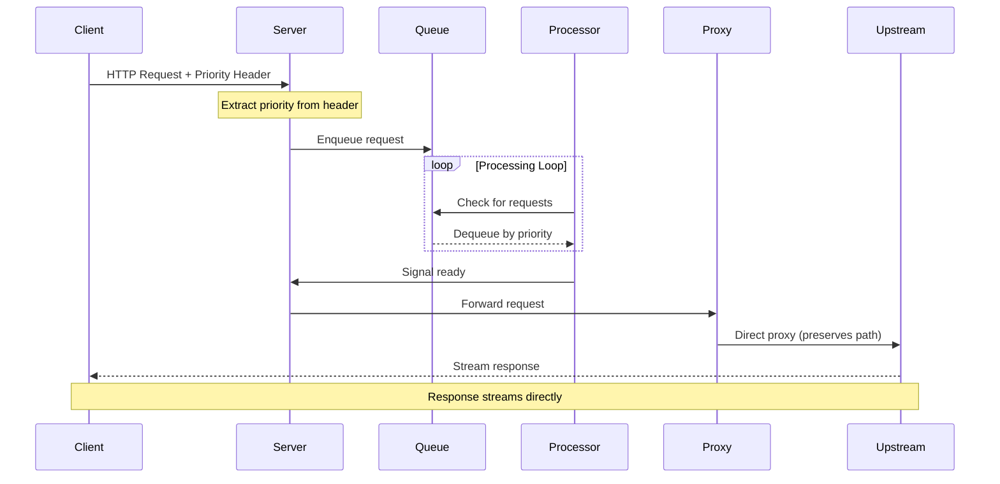
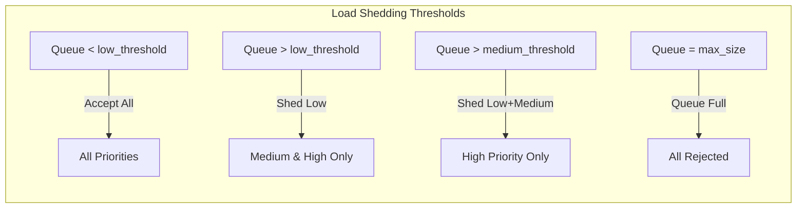

# Arbiter

Arbiter is a high-performance priority-based request gateway designed for sidecar deployment with resource-intensive services like vLLM. It manages request flow based on configurable priorities and processing modes, ensuring critical requests are processed first while maintaining system stability under load.

## Overview

Modern ML/LLM services often struggle with request prioritization and load management. Arbiter solves this by implementing a priority queue system that sits between clients and a single upstream service. The system uses a fire-and-forget architecture, handling high throughputs while being completely agnostic to response content types, including streaming responses like Server-Sent Events (SSE).

## Architecture

### Sidecar Deployment Model

Arbiter is designed to run as a companion alongside your service (e.g., vLLM), managing all incoming traffic:

```
Client → Arbiter (port 8080) → vLLM/Service (localhost:8000)
```

### Request Flow

When a request arrives at Arbiter, it follows this path through the system:



The server component receives incoming HTTP requests and extracts the priority from the `Priority` header. Each request is assigned one of three priority levels (High, Medium, or Low). The request path is preserved when forwarding to the upstream service.

The processor component continuously monitors the queue, respecting configured concurrency limits or batch settings. When capacity becomes available, it dequeues the highest priority request and signals the server that the request is ready for forwarding.

Once signaled, the server uses an embedded reverse proxy to forward the request directly to the upstream service. The response flows directly from the upstream back to the client without buffering in Arbiter.

### Priority Queue Implementation

The priority queue is implemented as a binary min-heap, providing efficient O(log n) operations for both enqueue and dequeue operations. Within each priority level, requests maintain FIFO ordering based on their enqueue timestamp.

### Processing Modes

Arbiter supports two processing modes:

**Individual Mode** processes requests one at a time as they're dequeued from the priority queue. The `max_concurrent` configuration controls how many requests can be in-flight simultaneously to the upstream. Ideal for services like REST APIs or vLLM servers that handle requests individually.

**Batch Mode** collects multiple requests over a time window before processing them as a group. The processor waits up to `batch_timeout` to collect up to `batch_size` requests. This mode is optimal for services that benefit from batched operations, such as ML inference endpoints that can process multiple inputs in a single forward pass.

## Configuration

Arbiter is configured through a YAML file:

### Individual Mode
```yaml
port: 8080

tracing:
  enabled: false
  endpoint: ""

upstream:
  url: "http://localhost:8000"  # vLLM default port
  mode: "individual"
  max_concurrent: 10  # Adjust based on vLLM capabilities
  timeout: 300s  # Long timeout for LLM inference
  queue:
    max_size: 100
    low_priority_shed_at: 30
    medium_priority_shed_at: 60
    request_max_age: 60s
```

### For Batch Processing
```yaml
port: 8080

upstream:
  url: "http://localhost:8000"
  mode: "batch"
  batch_size: 5
  batch_timeout: 100ms
  queue:
    max_size: 1000
    low_priority_shed_at: 500
    medium_priority_shed_at: 800
    request_max_age: 30s
```

### Configuration Validation

Arbiter validates configurations at startup and will fail with clear error messages for invalid settings:
- Invalid mode (must be "individual" or "batch")
- Missing required batch settings in batch mode
- Queue thresholds exceeding max_size
- Invalid priority shedding thresholds order

## Load Shedding

When the system is under heavy load, Arbiter implements intelligent load shedding based on queue depth and request priority:



Additionally, requests that exceed `request_max_age` in the queue are automatically shed to prevent stale requests from consuming resources.

## Kubernetes Deployment

### As a Sidecar

```yaml
apiVersion: v1
kind: Pod
metadata:
  name: vllm-with-arbiter
spec:
  containers:
    - name: vllm
      image: vllm/vllm-openai:latest
      ports:
        - containerPort: 8000  # Not exposed to service
    - name: arbiter
      image: your-registry/arbiter:latest
      ports:
        - containerPort: 8080  # Service targets this port
      volumeMounts:
        - name: config
          mountPath: /config
      command: ["./arbiter", "-config", "/config/config.yaml"]
  volumes:
    - name: config
      configMap:
        name: arbiter-config
```

### Service Configuration

```yaml
apiVersion: v1
kind: Service
metadata:
  name: vllm-service
spec:
  selector:
    app: vllm
  ports:
    - port: 80
      targetPort: 8080  # Points to Arbiter, not vLLM
```

### Traffic Splitting for Gradual Rollout

Using Gateway API:
```yaml
apiVersion: gateway.networking.k8s.io/v1
kind: HTTPRoute
spec:
  rules:
    - backendRefs:
        - name: vllm-direct
          port: 8000
          weight: 50
        - name: vllm-with-arbiter
          port: 8080
          weight: 50
```

## Metrics and Monitoring

Arbiter exposes comprehensive metrics through OpenTelemetry with a Prometheus-compatible endpoint at `/metrics`:

- Request metrics (count, duration, queue time) by priority level
- Queue depth and shed counts
- Batch processing metrics (for batch mode)

Additional endpoints:
- `/health` - Health check endpoint
- `/metrics` - Prometheus metrics

## Building and Running

Build Arbiter using Go 1.21 or later:

```bash
go build ./cmd/arbiter
```

Run with a configuration file:

```bash
./arbiter -config config.yaml
```

## Making Requests

Send requests to Arbiter with priority headers:

```bash
# High priority request
curl -X POST http://localhost:8080/v1/chat/completions \
  -H "Priority: high" \
  -H "Content-Type: application/json" \
  -d '{"model": "llama-2", "messages": [{"role": "user", "content": "Hello"}]}'

# Low priority request
curl -X POST http://localhost:8080/v1/chat/completions \
  -H "Priority: low" \
  -H "Content-Type: application/json" \
  -d '{"model": "llama-2", "messages": [{"role": "user", "content": "Tell me a story"}]}'
```

Priority values:
- `high`, `urgent`, `critical` → High priority
- `medium`, `normal`, `standard` → Medium priority
- `low`, `background`, `batch` → Low priority
- No header or unrecognized value → Low priority (default)

## Testing

The project includes test utilities:

### LLM Priority Test
```bash
go run cmd/llmtest/main.go
```
Sends multiple requests with different priorities to demonstrate priority ordering.

### Load Test
```bash
go run cmd/loadtest/main.go
```
Performs load testing with configurable request patterns.

## Performance Characteristics

- **Fire-and-forget architecture**: Request processing isn't blocked by slow upstream responses
- **O(log n) queue operations**: Efficient even with large queue depths
- **Zero-copy streaming**: Responses stream directly from upstream to client
- **Minimal memory footprint**: Only request metadata is queued, not bodies

## Use Cases

Arbiter is ideal for:

1. **vLLM/LLM Deployments**: Manage request priorities for production vs development traffic
2. **ML Inference Services**: Batch requests for efficient GPU utilization
3. **Rate-Limited APIs**: Control request flow to respect upstream limits
4. **Mixed Workload Systems**: Ensure critical requests aren't blocked by bulk operations

## Environment Variables

For containerized deployments, you can override configuration with environment variables:

```bash
ARBITER_PORT=8080
ARBITER_UPSTREAM_URL=http://localhost:8000
ARBITER_UPSTREAM_MODE=individual
ARBITER_UPSTREAM_MAX_CONCURRENT=10
```

## Graceful Shutdown

Arbiter handles shutdown signals gracefully:
1. Stops accepting new requests
2. Waits for in-flight requests to complete
3. Drains the queue processor
4. Cleanly shuts down with timeout for trace flushing

## License

MIT